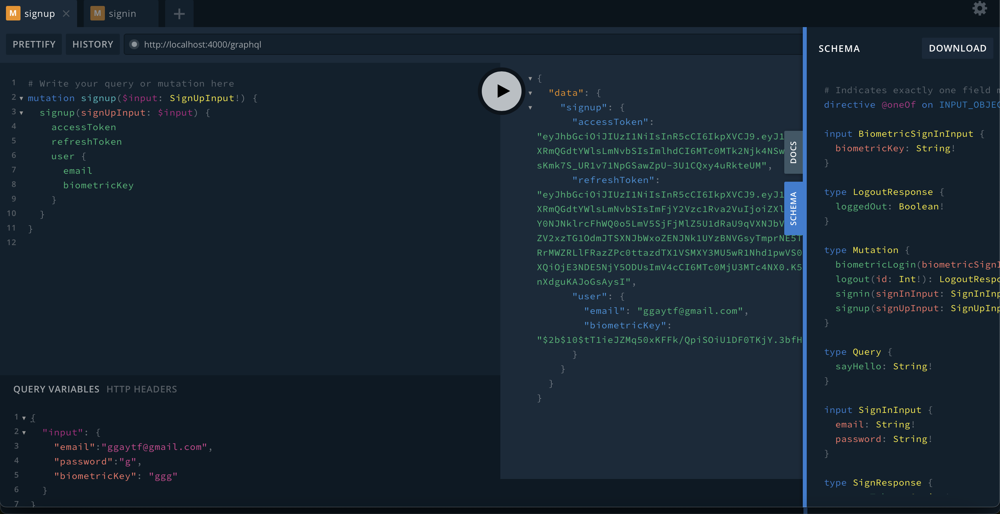
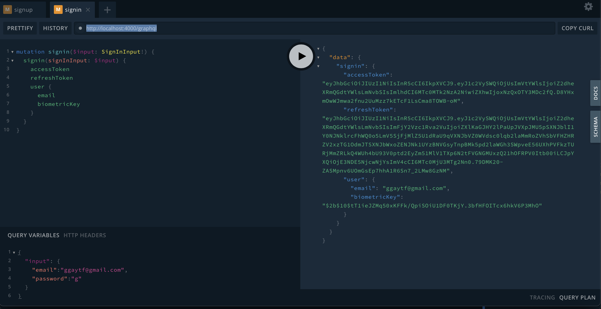

# This is a technical test for Digital Vision

## Technology Used
 - NestJS
 - NestJS GraphQL
 - Prisma ORM
 - PostgreSQL as database

 ## Database Setup
 - install docker if you don't have one
 - Run ` docker compose up` to spring up the database connection
 - Run ` mv .env.sample .env` to rename the sample env
 - Run ` npx prisma migrate dev --name init` to create the database schema 
 - Run ` npx prisma generate` to generate ObjectTypes, Args etc
 - Run ` npx prisma db seed` to seed the Roles and Permissions
 - After this Run the project `npm run start:dev`
 - Open http://localhost:4000/graphql 
 - Now Run your mutations, queries  from GraphQL Play Ground play ground

 ## Create User from GrapgQL
 - Follow the screen shot sample on how to add the neceassary body and parameters to GraphQL
 

 ## Login created User from GrapgQL
 - The screenshot shows how you can login view GraphQl
 

 ## Features 
  - Register User
  - Login Registered User
  - Login with biometricKey